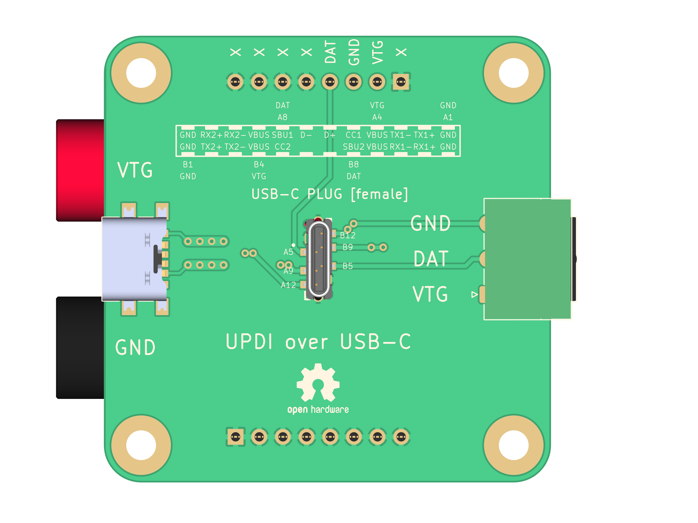

<!-- Begin README -->

<h1 align="center">UPDI over USB-C</h1>

<p align="center">
    
    </br>
    </br>
    <a href="https://daringfireball.net/projects/markdown/"></a>
    <a href="https://github.com/bajraan"></a>
    <a href="mailto:bajran1616@gmail.com"></a>
</p>
</br>
</br>
<p align="center">
    
</p>
<p align="center">
    
    <br>
</p>

</br>
</br>
<div align="center">
    <a href="https://www.kicad.org/">
    </a>
    <a href="https://www.freecad.org/">
    </a>
    <a href="https://github.com/bennymeg/Fabrication-Toolkit">
    </a>
    <a href="https://wiki.freecad.org/KicadStepUp_Workbench/it">
    </a>
</div>

</br>
</br>

## Content  [Project Utilization]

- [Features](##Features)
- [Diagram](##Diagram)
- [Use Case 1](##UseCase1)
- [Use Case 2](##UseCase2)

## Content [Project Development]

- [Workflow](##Workflow)
- [Software](##Software)

## Features
```markdown
1. Programing target sample over USB-C cable interface
2. Compatible with MICROCHIP PicKit 4 programmer
3. Powering target device over USB-C cable interface
4. Wide capabilities of power connectors
```
## Diagram
## Use Case 1
## Use Case 2

## Software
```markdown
[KiCAD](https://www.kicad.org/)
[FreeCAD](https://www.freecad.org/)
[FreeCAD][Kicad Step UP]()
[KiCAD][fabrication toolkig]()
```

## Workflow
```markdown
1. KiCAD  [/KiCAD_H7911_MAIN] Create PCB as a Panel

2. KiCAD  [/KiCAD_H7911_MAIN] export to KiCAD_Export_H7911-PCB-1over2
3. KiCAD  [/KiCAD_H7911_MAIN] export to KiCAD_Export_H7911-PCB-2over2

4. KiCAD  KiCAD_Export_H7911-PCB-1over2 prepare and export silkscreen
5. KiCAD  KiCAD_Export_H7911-PCB-2over2 prepare and export silkscreen

6. Import PCB to FreeCAD using KiCAD Step Up WorkBench

    1. FreeCAD  [/FreeCAD] import .kicad_pcb shape 1over2
    2. FreeCAD  [/FreeCAD] import .kicad_pcb tracks 1over2
    3. FreeCAD  [/FreeCAD] import .dxf silkscreen 1over2
    4. FreeCAD  [/FreeCAD] import .kicad_pcb shape 2over2
    5. FreeCAD  [/FreeCAD] import .kicad_pcb tracks 2over2
    6. FreeCAD  [/FreeCAD] import .dxf silkscreen 2over2

7. FreeCAD  [/FreeCAD] Move pcb 1over2 to the correnct place
8. FreeCAD  [/FreeCAD] Housing desing based on PCB shapes
9. FreeCAD  [/FreeCAD] Export housing shape to the .stl file
10. KiCAD  [/KiCAD_H7911_MAIN] Export fabrication data
11. KiCAD  [/KiCAD_H7911_MAIN] Order PCB for example from jlcpcb.com 
```
## helping re-sources

https://www.youtube.com/watch?v=b3NoAOxOGxA

## Workflow Examples

**_KiCAD_Export_H7911-PCB-1over2 prepare and export silkscreen_**
<br/>

-------------------
<br/>

> [!NOTE] 
>**_KiCAD_Export_H7911-PCB-1over2 prepare and export silkscreen_**
<br/>

-------------------

> [!NOTE] 
> Exporting PCB
> Import PCB to FreeCAD using KiCAD Step Up WorkBench
Move pcb 1over2 to the correnct place
Housing desing based on PCB shapes
Export housing shape to the .stl file
KiCAD_H7911_MAIN Export fabrication data
Order PCB for example from jlcpcb.com
Cutting Panel PCB

## PCB panel view


## Images
```markdown


```
 <br>


*Add #gh-light-mode-only or #gh-dark-mode-only to the end of the image link to make it only visible in light or dark mode, respectively.*

## Code: 
test item
### Inline code:

```markdown
Here is `inline code`.
```
Here is `inline code`.

### Block code without syntax highlighting:

```markdown
```This is a block of code.```
```
```
This is a block of code.
```

### Block code with syntax highlighting:

```markdown
```python 
print("Hello, world!")
```

```python
print("Hello, world!")
```

## Tables

```markdown
| Header One     | Header Two     |
| -------------- | -------------- |
| Content Cell 1 | Content Cell 2 |
| Content Cell 3 | Content Cell 4 |
```
| Header One     | Header Two     |
| -------------- | -------------- |
| Content Cell 1 | Content Cell 2 |
| Content Cell 3 | Content Cell 4 |

## Horizontal Rules

Use three or more dashes, asterisks, or underscores:

```markdown
---
***
___
```
---
***
___

## Blockquotes

``` markdown
> This is a blockquote.
>
> > This is a nested blockquote.
```
> This is a blockquote.
>
> > This is a nested blockquote.


## Escaping Characters
## Task Lists
### Alerts

GitHub Flavored Markdown supports alerts that can be used to highlight important information:

```markdown
  > [!NOTE]  
  > Highlights information that users should take into account, even when skimming.

  > [!TIP]
  > Optional information to help a user be more successful.

  > [!IMPORTANT]  
  > Crucial information necessary for users to succeed.

  > [!WARNING]  
  > Critical content demanding immediate user attention due to potential risks.

  > [!CAUTION]
  > Negative potential consequences of an action.
```

> [!NOTE]  
> Highlights information that users should take into account, even when skimming.

> [!TIP]
> Optional information to help a user be more successful.

> [!IMPORTANT]  
> Crucial information necessary for users to succeed.

> [!WARNING]  
> Critical content demanding immediate user attention due to potential risks.

> [!CAUTION]
> Negative potential consequences of an action.

## Closing

Remember, not all of these features are supported in every Markdown processor. Always check your specific processor's documentation for supported features.

You can use this as a README for your repository. Feel free to expand and improve the guide to better fit your requirements or to add more advanced features. Also, feel free to contribute and expand this guide for better community knowledge.

## Resources

- [Markdown Guide](https://www.markdownguide.org/) - A free and open-source reference guide that explains how to use Markdown.
- [Daring Fireball](https://daringfireball.net/projects/markdown/) - The original Markdown project by John Gruber.
- [GitHub Flavored Markdown](https://github.github.com/gfm/) - GitHub's variant of Markdown, which includes features like task lists and tables.
- [CommonMark](https://commonmark.org/) - A strong specification of Markdown, designed to clarify many edge cases and inconsistencies in the original Markdown specification.
- [Markdown Cheatsheet](https://github.com/adam-p/markdown-here/wiki/Markdown-Cheatsheet) - A quick reference to Markdown syntax.
- [Pandoc](https://pandoc.org/) - A universal document converter that supports Markdown and many other markup languages.
- [StackEdit](https://stackedit.io/) - An in-browser Markdown editor.
- [Markdown Tutorial](https://chat.openai.com/?model=gpt-4#:~:text=browser%20Markdown%20editor.-,Markdown%20Tutorial,-%3A%20An%20interactive%20tutorial) - An interactive tutorial to learn Markdown.
- [Jupyter Notebook](https://jupyter.org/) - Although not strictly a Markdown resource, Jupyter Notebooks use Markdown for all non-code cells, making it a useful tool for scientific documentation where code and commentary are intermixed.
- [GitHub Markdown Alerts](https://blog.jakelee.co.uk/github-alert-experiments/) - A blog post that discusses the use of GitHub Markdown Alerts
- [GitHub Markdown Alerts Discussion](https://github.com/orgs/community/discussions/16925) - A GitHub discussion that discusses the use of GitHub Markdown Alerts

## License

This project is released under the terms of the **MIT License**, which permits use, modification, and distribution of the code, subject to the conditions outlined in the license.
- The [MIT License](https://choosealicense.com/licenses/mit/) provides certain freedoms while preserving rights of attribution to the original creators.
- For more details, see the [LICENSE](LICENSE) file in this repository. in this repository.

## Credits

**Author:** [Scott Grivner](https://github.com/scottgriv) <br>
**Email:** [scott.grivner@gmail.com](mailto:scott.grivner@gmail.com) <br>
**Website:** [scottgrivner.dev](https://www.scottgrivner.dev) <br>
**Reference:** [Main Branch](https://github.com/scottgriv/markdown-demo) <br>

---------------

<div align="center">
    
</div>

<!-- End README -->